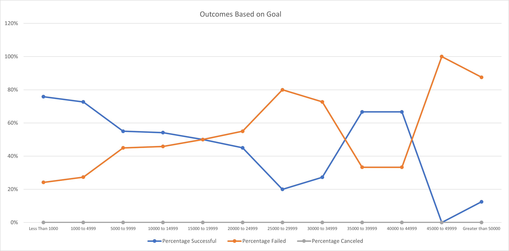

# Kickstarting with Excel

## Overview of Project
Louise’s play Fever came close to its fundraising goal in a short amount of time. Now, she wants to know how different campaigns fared in relation to their launch dates and their funding goals.
### Purpose
Based on the data provided for Kickstart analysis, it is needed to used Excel tools to provide analysis to Louise and comments on how different campaigns fared in relation to their launch date and their funding goals.
## Analysis and Challenges
- First, it was generated a linear chart for “Theaters” per month, identifying the quantity ids per outcome (successful, failed and canceled). 
-  
- Secondly, it was generated a linear chart for “Plays” per Goal amount categorization (12 different dollar amount ranges), identifying the percentage that represent per each range those successful, those which failed and those which were cancelled. 
- 

### Analysis of Outcomes Based on Launch Date
Best outcome brought to theater occurs from May to August.
February and October are also good months because on both months the tendency reverts (change from negative to positive). 
No matter if the outcome is successful or failed, the movements explained above are shown in both lines.
December is a bad month for successful outcome as it reached the same amount as the failed projects.

### Analysis of Outcomes Based on Goals
The successful percentage of plays based on Goals exceed 50% with Goals below $15,000 and between $35,000 to $45,000.
The rest of ranges, Failed plays exceed the successful ones.
Worst goals are presented for plays with outcome greater than $45,000.

### Challenges and Difficulties Encountered
What I can mention as a limitation is that data does not include external factors as economic situations per year or per country, which may affect the outcome of the Theater and Plays.
## Results

- What are two conclusions you can draw about the Outcomes based on Launch Date?
Best outcome brought to theater occurs from May to August.
February and October are also good months because on both months the tendency reverts (change from negative to positive). 
No matter if the outcome is successful or failed, the movements explained above are shown in both lines.
December is a bad month for successful outcome as it reached the same amount as the failed projects.

- What can you conclude about the Outcomes based on Goals?
The successful percentage of plays based on Goals exceed 50% with Goals below $15,000 and between $35,000 to $45,000.
The rest of ranges, Failed plays exceed the successful ones.
Worst goals are presented for plays with outcome greater than $45,000.

- What are some limitations of this dataset?
What I can mention as a limitation is that data does not include external factors as economic situations per year or per country, which may affect the outcome of the Theater and Plays.

- What are some other possible tables and/or graphs that we could create?
You can elaborate Tables and graphs per country to verify is same visual effect happens in each country and calculates any correlation maybe by region.
